# AQA A Level Computer Science Project Writeup

## Analysis
### Background to and identification of problem
#### Overview of Scenario and Current User setup
Hampshire County Councils School Library Service loans large numbers of books (200+) to schools in Hampshire.
Their current system is limited to tracking number of books loaned.
The current system is managed using a group of "three?" excel spreadsheets for managing school data, 
subscription information and loan details. 

### Description of current system
The current system is managed by a collection of excel spreadsheets. 
One of these spreadsheets contains contact information, addresses and dates needed for site visits to 
collect and drop off books that have been selected or ordered and to perform a stock check to assess the 
amount of books lost and damaged and either replace for free if under a certain level or for a fee if the 
number of books is significant.

 **insert excel spreadsheet analysis** 
### Data collection and research:
#### Questionnaire:
Survey made on Enalyzer.

Question 1:


Question 2:


Question 3:


Question 4:


Question 5:

#### Results:
 **\*Insert Results here***

### Identification of prospective users
The users would be the librarians at the Hampshire School Library Service who could use it to manage the loans easier.
### Identification of user needs and acceptable limitations
####Features requested:

#### Features priority based on number of suggestions:

### Data sources and destinations
#### Sources:
* Google Books for details about the books.
* Input devices for ISBNs
#### Destinations:
* Database for long term storage of data.
* Printable reports.
### Data Volumes
Data is stored in a series of database tables currently using sqlite as the backend.
### Object analysis diagram
### Analysis data dictionary and ERD
### Realistic appraisal of the feasibility of potential solutions
### Justification of chosen solution
## Design
### Overall System Design
### Description of modular structure of system
#### Modules:
All of the code has been separated into different python modules (*.py).
These modules can be imported into other parts of the code to allow modularity in the structure of the program. 
The modules also reduce the amount of code needed to be written as they can imported to allow the calling of the functions inside the modules. 
#### Objects:
Objects are callable by any other part of the code where the modules are imported. 

Some objects that I've implemented are:
* Entry form object
* book details object
* Homepage object
* Multientry form object
* settings menu object
* School Details View menu
* School Details Buttons menu

| Object:       | Description: |Uses:| Called by: | Calls: |
|---------------|--------------|------------|------------|--------|
| Entry Form    |For entering a single value to be processed.|Enering an ISBN to view the details of that book.|Homepage|Book Details|
| Book Details  |Displays the title, author, etc that is passed into the object.|Displaying the details of a book.|Entry Form|Homepage| 
| Homepage      |The main menu of the program. Has buttons to call each of the parts of the program.|Calling smaller independent parts of the program such as Settings and the Multientry form.|Starting the program, Book Details, Settings, Multientry, Entry Form.|Entry Form, Multientry, Settings Menu|
| Multientry    |For entering multiple values to be processed.|Entering many ISBNs to be assigned to a loan.|Homepage|##N/A##|
| Settings Menu |Changing settings that apply globally to the program.|Changing the colour theme of the program.|Homepage|Homepage|
|School Details View|For the viewing, editing or creating of school profiles in the database.|Can be used to create a new school profile in the database, edit a pre-existing one or viewing the details of one.|School Details Init.|Homepage.|
|School Details Init|Initialising the school details view object.|Opens the School Details View in new school mode for creating a new school or selecting an existing school|Homepage.|School Details View.|

### Definition of data requirements 
### Identification of appropriate storage media
### Entity relationship diagram(Normalised)
#### Entity Relationship Diagram:

Code: 
```
graph LR
 Homepage-->School-Details-Start(School Details Start)
 School-Details-Start-->School-Details
 School-Details-->Homepage

 Homepage-->Multi-Entry
 Multi-Entry-->Homepage

 Homepage-->Entry-Form(Entry Form)
 Entry-Form-->Book-Details(Book Details)
 Book-Details-->Homepage

 Settings-->Homepage{Homepage}
 Homepage-->Settings(Settings)
 Settings-.-theme((theme.json))

 School-Details-.-SQL((SQL.py))
 School-Details-Start-.-SQL((SQL.py))
 Book-Details-.-SQL((SQL.py))
 Multi-Entry-.-SQL((SQL.py))
 Book-Details-.-GB((Google Books))
 Multi-Entry-.-GB((Google Books))

 subgraph Key
  key1{Main Menu}
  key2(Simple GUI Module)
  key3((Data Storage))
  key1-- Module Calling -->key2
  key2-. Data Transfer .-key3
 end
```
#### Key:
Code:
graph LR
key1{Main Menu}
key2(Simple GUI Module)
key3((Data Storage))
key1-- Module Calling -->key2
key2-. Data Transfer .-key3
### Identification of processes and suitable algorithms for data transformation

### Class and object diagrams 
### User interface design (HC)
#### Single Entry:
Used for isbn entry.

Text boxes: entry field.
* Entry field: user enters isbn or other single entry data.
Button: Submit.
* Submit: submits data in entry field. saves to input table in database for next program to access. need to find another way to return the value.

Image:

#### Books Details:
Text boxes: title, author, genre, released, binding, age, label, blurb.
* Title: Book title and subtitle (maybe??) 
* Author: authors. pretty self explanatory
* Genre: genre of book
* Released: release date
* binding: should be paperback or hard cover. doesnt work. can be repurposed.
* age: age rating ("mature" or "not mature")
* label: blank. can be repurposed.
* blurb: the book blurb.

Canvas: image
* image: book cover image

Buttons: save changes, close, revert to online data.
* Save changes: gets the data from the editable text boxes and saves it to a database.
* close: closes the window.
* revert to online data: deletes the database version of the book details and lets the program use the google books data instead.

Image: 

 .PNG "Books Details")


### Hardware specification 
#### Input Devices 
Currently Required: Keyboard, Mouse. 
Optional: Barcode Scanner (untested)
* Keyboard: allows manual entry of barcodes and editing of book details.
* Mouse: for interaction with buttons on the forms as pressing enter after typing doesnt work. (tab is untested.)
* Barcode scanner: easier input of isbns stored as barcodes on most books.
#### Output Devices
Required: Monitor.
* Monitor: viewing of GUI.
#### Storage devices
Required: Program files and sqlite database. unknown sizes as unfinished. database may be moved to a server.
#### Processor and Memory requirements
* a processor is required. working: i5-4460, i5-4210M \n
* some amount of ram is required. working: 8gb sodimm ddr3, 8gb ddr3 desktop dimm

### Table:

|               | Processors | Memory        | Storage                        | OS        | Screen Resolution | Peripherals      |
|---------------|------------|---------------|--------------------------------|-----------|-------------------|------------------|
| Minimum:      | i5-4210M   |8GB SODIMM DDR3|80.1MB w/out third-party modules|Win7 32bit |                   |Keyboard and Mouse|
| Recommended:  |            |               |8GB with all required modules   |Win10 64bit| 1920x1080@60Hz    |                  |
| Also Working: | i5-4460    |8GB DIMM DDR3  |                                |           | 1920x1080@60Hz    |                  |


## Testing

### Description of measures planned for security and integrity of data and system security
* sql injection prevention

### Overall test strategy 
* test for sql injection
* see if it breaks under normal use cases
* test under extreme use cases to see if it breaks

### Testing Details

## System Maintenance
### System Overview
### Sampled Detailed Algorithms

## User Guide 
### Contents

## Evaluation
## Program Code

