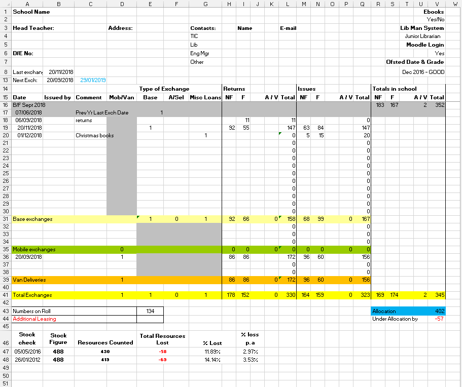
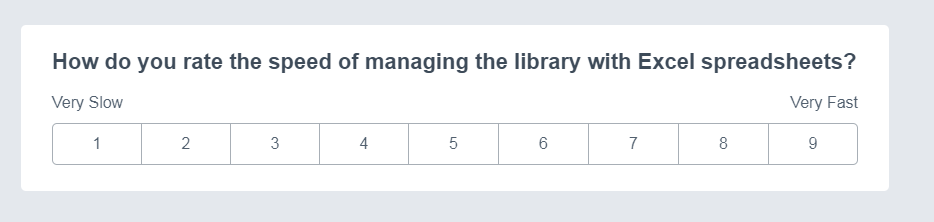
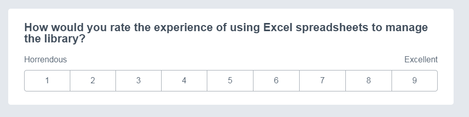
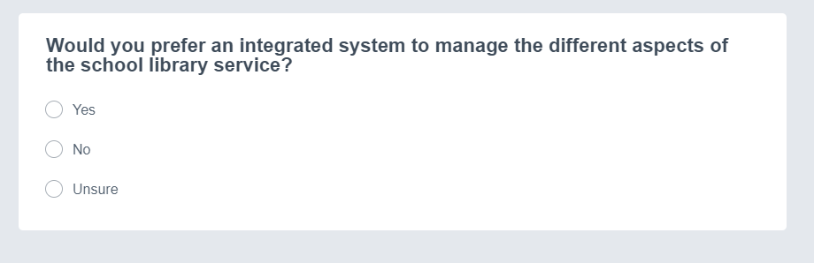
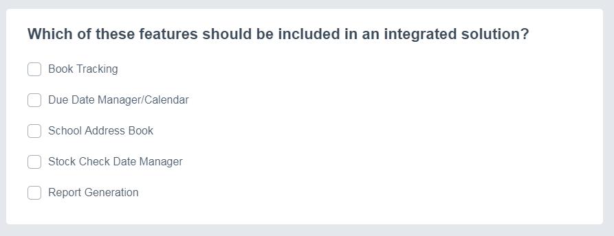
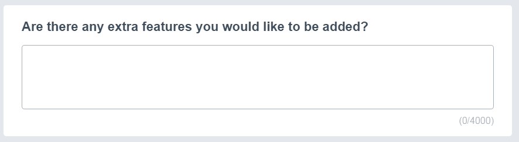
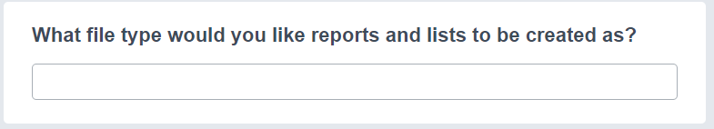
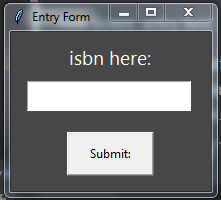

# AQA A Level Computer Science Project Writeup

## Analysis

### Introduction
Hampshire County Council's School Library Service (SLS) loans books to over 400 schools in Hampshire and has 4 centres
located in Basingstoke, Farnborough, Fareham and the New Forest.
The SLS provides various services as well, including loaning books and e-resources, 
training and advisory/support services.
The school's exchange books by visiting a centre or receiving delivery via a small fleet of vans.
The standard allocation of books is 3 per pupil at primary level and 2 per pupil at secondary with a maximum loan of 
200 books per exchange.

### Description of current system
Currently, the SLS only tracks the quantity of books at a given location using an excel spreadsheet for each 
centre and one tab for each school. Each tab contains the details about the school (listed below) as well as the details
of each exchange including the number of books and the date.
When a school visits a centre to exchange books, the library assistants at the centre physically count all of the books 
as they come in and go out and record this in the spreadsheet which then calculates the total for the school. 

The problem was researched by speaking with one of the library assistants as well as conducting a survey amongst the rest.
I also went to a showcase day for library management systems aimed for internal use in a school library. 
These use a similar principle to my project however they work on a different level with reference to 
different volumes of users and books. 

The main issue with the current system is that the library assistants have no way of knowing where books are located.
Currently a school can't request a list of books that they have since there is no tracking data available to look this up with.
Another issue is that one school is not supposed to have more than two copies of any book in particular but this is difficult
to manage since there isn't a list of what books they have to check against.

#### General Details for a School
Each school currently has it's own tab in the spreadsheet. At the top of each tab is a header containing information such as:
* School Name
* Head Teachers Name
* Address
* Contact Details
* The DfE Number (unique number assigned by the Department for Education to each school)
* Date of the Last Exchange
* Number of Pupils

Below these details, there is a table of the exchanges and details of them including:
* Date
* Comments/Notes
* Type of exchange
* Number of books returned
* Number of books issued



 **insert excel spreadsheet analysis** 
### Data collection and research:
#### Questionnaire:
Survey made on Enalyzer.

Question 1:


Question 2:


Question 3:


Question 4:


Question 5:


Question 6:

#### Results:
 **\*Insert Results here***

### Identification of prospective users
The users would be the librarians at the Hampshire School Library Service who could use it to manage the loans easier.
### Identification of user needs and acceptable limitations
#### Features requested:
* Reports
* Calendar
* no more than 2 of a certain title per school.

* format for reports

#### Features priority based on number of suggestions:

### Data sources and destinations
#### Sources:
* Google Books for details about the books.
* Input devices for ISBNs
#### Destinations:
* Database for long term storage of data.
* Printable reports.
### Data Volumes
Data is stored in a series of database tables currently using sqlite as the backend.
### Object analysis diagram
### Objectives for Proposed System:
| Objective                | Details                                                                                                                                                  |
|--------------------------|----------------------------------------------------------------------------------------------------------------------------------------------------------|
| Key Objective I          | The system must be able to sign books in and out to different schools.                                                                                   |
| Key Objective II         | The system should keep track of books in-stock and at different the schools.                                                                             |
| Key Objective III        | The system should have a database to store details about the schools that are subscribed to the service.                                                 |
| Key Objective IV         | The system must be able to produce reports about the loan history of individual schools and the service as a whole.                                      |
| Key Objective V          | The system should have a login policy to protect sensitive data about the subscribed schools.                                                            |
| Key Objective VI         | The graphical user interface must be user friendly and intuitive.                                                                                        |
| Key Objective VII        | The system should protect the database from SQL Injection attacks that could otherwise cause irreversible damage to the structure and contents of it.    |
| Additional Objective I   | The system should use Object Oriented Programming where possible                                                                                         |
| Additional Objective II  | The system could have a settings menu where the user can customise their experience (e.g. colour themes) and change the locations of any required files. |
| Additional Objective III | The system could have a calendar system to manage school visits.                                                                                         |
| Additional Objective IV  | The systems reporting function could calculate various statistics about their visits, borrowing history and amount of lost/damaged books.                |
| Additional Objective V   | The system could have a lookup system for books pertaining to a particular topic with a way to check their location.                                     |
| Additional Objective VI  | The system should be able to make use of a barcode scanner for faster signing in and out of books.                                                       |
| Additional Objective VII | The system should be simple to setup and install on the target users computers.                                                                          |

### Analysis data dictionary and ERD
### Realistic appraisal of the feasibility of potential solutions:
Key:

| Character | Note |
|---:|:-----------------|
| 🗸 | Very difficult but still possible |
| ✓ | Possible but time consuming       |
| ✔ | Yes                               |
| ❌ | No or not practical               |


| Project Method        | Windows | MacOS | Linux | Android | iOS | Experienced with | Has libraries to use | Supports USB Scanners |
|-----------------------|---------|-------|-------|---------|-----|------------------|----------------------|----------------------|
| Python Text Interface |    ✔    |  ✔   |  ✔    |   ❌    |  ❌  |       ✔         | ✔                   | ✔                     |
| Python Tkinter GUI    |    ✔    |  ✔   |  ✔    |   ✓    |  🗸  |       ✔          | ✔                   | ✓ (bluetooth version required for android and iOS) |
| Python Kivy GUI       |    ✔    |  ✔   |  ✔    |   ✔    |  ✔  |       🗸          | ✔                   | ✓ (bluetooth version required for android and iOS) |
| Visual Basic          |    ✔    |  ❌   |  ❌   |   ❌    |  ❌  |       ✔          | ❌                   | ✔                     |
| Java                  |    ✔    |  ✔   |  ✔    |   ✔    |  ✔  |       ❌          | ❌                   | ✔                     |
| WebApp                |    ✔    |  ✔   |  ✔    |    ✔   |  ✔  |       ❌          | ✔                   | ✓ (more setup required on user end +bluetooth version for mobile) |

### Justification of chosen solution:

* Python with Tkinter GUI

I have chosen to use Python with Tkinter for the GUI as my method of choice for my project. I am using it because 
I know python quite well (compared to VB which is the only other language I have used before) and I have 
already learnt Tkinter as a GUI implementation for python as opposed to learning Kivy just for being able to 
easily put the program on mobile devices.

I also know that the users have Windows machines as their desk computers at the site meaning mobile 
devices aren't a required feature.

## Design
### Overall System Design
### Description of modular structure of system
#### Modules:
All of the code has been separated into different python modules (*.py).
These modules can be imported into other parts of the code to allow modularity in the structure of the program. 
The modules also reduce the amount of code needed to be written as they can imported to allow the calling of the functions inside the modules. 
#### Objects:
Objects are callable by any other part of the code where the modules are imported. 

Some objects that I've implemented are:
* Entry form object
* book details object
* Homepage object
* Multientry form object
* settings menu object
* School Details View menu
* School Details Buttons menu

| Object:       | Description: |Uses:| Called by: | Calls: |
|---------------|--------------|------------|------------|--------|
| Entry Form    |For entering a single value to be processed.|Enering an ISBN to view the details of that book.|Homepage|Book Details|
| Book Details  |Displays the title, author, etc that is passed into the object.|Displaying the details of a book.|Entry Form|Homepage| 
| Homepage      |The main menu of the program. Has buttons to call each of the parts of the program.|Calling smaller independent parts of the program such as Settings and the Multientry form.|Starting the program, Book Details, Settings, Multientry, Entry Form.|Entry Form, Multientry, Settings Menu|
| Multientry    |For entering multiple values to be processed.|Entering many ISBNs to be assigned to a loan.|Homepage|##N/A##|
| Settings Menu |Changing settings that apply globally to the program.|Changing the colour theme of the program.|Homepage|Homepage|
|School Details View|For the viewing, editing or creating of school profiles in the database.|Can be used to create a new school profile in the database, edit a pre-existing one or viewing the details of one.|School Details Init.|Homepage.|
|School Details Init|Initialising the school details view object.|Opens the School Details View in new school mode for creating a new school or selecting an existing school|Homepage.|School Details View.|

### Definition of data requirements 
### Identification of appropriate storage media
### Entity relationship diagram(Normalised)
#### Entity Relationship Diagram:

#### Code: 
```
graph LR
 Homepage-->School-Details-Start(School Details Start)
 School-Details-Start-->School-Details
 School-Details-->Homepage

 Homepage-->Multi-Entry
 Multi-Entry-->Homepage

 Homepage-->Entry-Form(Entry Form)
 Entry-Form-->Book-Details(Book Details)
 Book-Details-->Homepage

 Settings-->Homepage{Homepage}
 Homepage-->Settings(Settings)
 Settings-.-theme((theme.json))

 School-Details-.-SQL((SQL.py))
 School-Details-Start-.-SQL((SQL.py))
 Book-Details-.-SQL((SQL.py))
 Multi-Entry-.-SQL((SQL.py))
 Book-Details-.-GB((Google Books))
 Multi-Entry-.-GB((Google Books))

 subgraph Key
  key1{Main Menu}
  key2(Simple GUI Module)
  key3((Data Storage))
  key1-- Module Calling -->key2
  key2-. Data Transfer .-key3
 end
```
https://mermaidjs.github.io/mermaid-live-editor/

### Identification of processes and suitable algorithms for data transformation

### Class and object diagrams 
### User interface design (HC)
#### Single Entry:
Used for isbn entry.

Text boxes: entry field.
* Entry field: user enters isbn or other single entry data.
Button: Submit.
* Submit: submits data in entry field. saves to input table in database for next program to access. need to find another way to return the value.

Image:

#### Books Details:
Text boxes: title, author, genre, released, binding, age, label, blurb.
* Title: Book title and subtitle (maybe??) 
* Author: authors. pretty self explanatory
* Genre: genre of book
* Released: release date
* binding: should be paperback or hard cover. doesnt work. can be repurposed.
* age: age rating ("mature" or "not mature")
* label: blank. can be repurposed.
* blurb: the book blurb.

Canvas: image
* image: book cover image

Buttons: save changes, close, revert to online data.
* Save changes: gets the data from the editable text boxes and saves it to a database.
* close: closes the window.
* revert to online data: deletes the database version of the book details and lets the program use the google books data instead.

Image: 

 .PNG "Books Details")


### Hardware specification 
#### Input Devices 
Currently Required: Keyboard, Mouse. 
Optional: Barcode Scanner (untested)
* Keyboard: allows manual entry of barcodes and editing of book details.
* Mouse: for interaction with buttons on the forms as pressing enter after typing doesnt work. (tab is untested.)
* Barcode scanner: easier input of isbns stored as barcodes on most books.
#### Output Devices
Required: Monitor.
* Monitor: viewing of GUI.
#### Storage devices
Required: Program files and sqlite database. unknown sizes as unfinished. database may be moved to a server.
#### Processor and Memory requirements
* a processor is required. working: i5-4460, i5-4210M \n
* some amount of ram is required. working: 8gb sodimm ddr3, 8gb ddr3 desktop dimm

#### Table:

|               | Processors | Memory        | Storage                        | OS        | Screen Resolution | Peripherals      |
|---------------|------------|---------------|--------------------------------|-----------|-------------------|------------------|
| Minimum:      | i5-4210M   |8GB SODIMM DDR3|80.1MB w/out third-party modules|Win7 32bit |                   |Keyboard and Mouse|
| Recommended:  |            |               |8GB with all required modules   |Win10 64bit| 1920x1080@60Hz    |                  |
| Also Working: | i5-4460    |8GB DIMM DDR3  |                                |           | 1920x1080@60Hz    |                  |


## Testing

### Description of measures planned for security and integrity of data and system security
* sql injection prevention

### Overall test strategy 
* test for sql injection
* see if it breaks under normal use cases
* test under extreme use cases to see if it breaks

### Testing Details

## System Maintenance
### System Overview
### Sampled Detailed Algorithms

## User Guide 
### Contents

## Evaluation
## Program Code

