# AQA A Level Computer Science Project Writeup

## Analysis

### Introduction
Hampshire County Council's School Library Service (SLS) loans books to over 400 schools in Hampshire and has 4 centres
located in Basingstoke, Farnborough, Fareham and the New Forest.
The SLS provides various services as well, including loaning books and e-resources,
training and advisory/support services.
The school's exchange books by visiting a centre or receiving delivery via a small fleet of vans.
The standard allocation of books is 3 per pupil at primary level and 2 per pupil at secondary with a maximum loan of
200 books per exchange.

### Description of current system
Currently, the SLS only tracks the quantity of books at a given location using an excel spreadsheet for each
centre and one tab for each school. Each tab contains the details about the school (listed below) as well as the details
of each exchange including the number of books and the date.
When a school visits a centre to exchange books, the library assistants at the centre physically count all of the books
as they come in and go out and record this in the spreadsheet which then calculates the total for the school.

The problem was researched by speaking with one of the library assistants as well as conducting a survey amongst the rest.
I also went to a showcase day for library management systems aimed for internal use in a school library.
These use a similar principle to my project however they work on a different level with reference to
different volumes of users and books.

The main issue with the current system is that the library assistants have no way of knowing where books are located.
Currently a school can't request a list of books that they have since there is no tracking data available to look this up with.
Another issue is that one school is not supposed to have more than two copies of any book in particular but this is difficult
to manage since there isn't a list of what books they have to check against.

#### General Details for a School
Each school currently has it's own tab in the spreadsheet. At the top of each tab is a header containing information such as:
* School Name
* Head Teachers Name
* Address
* Contact Details
* The DfE Number (unique number assigned by the Department for Education to each school)
* Date of the Last Exchange
* Number of Pupils

Below these details, there is a table of the exchanges and details of them including:
* Date
* Comments/Notes
* Type of exchange
* Number of books returned
* Number of books issued


 **insert excel spreadsheet analysis**
### Data collection and research:
#### Identification of End Users:
The users would be the librarians at the Hampshire School Library Service who could use it to manage the loans easier.
#### Questionnaire:
Survey made on Enalyzer.

Questions about the current system:

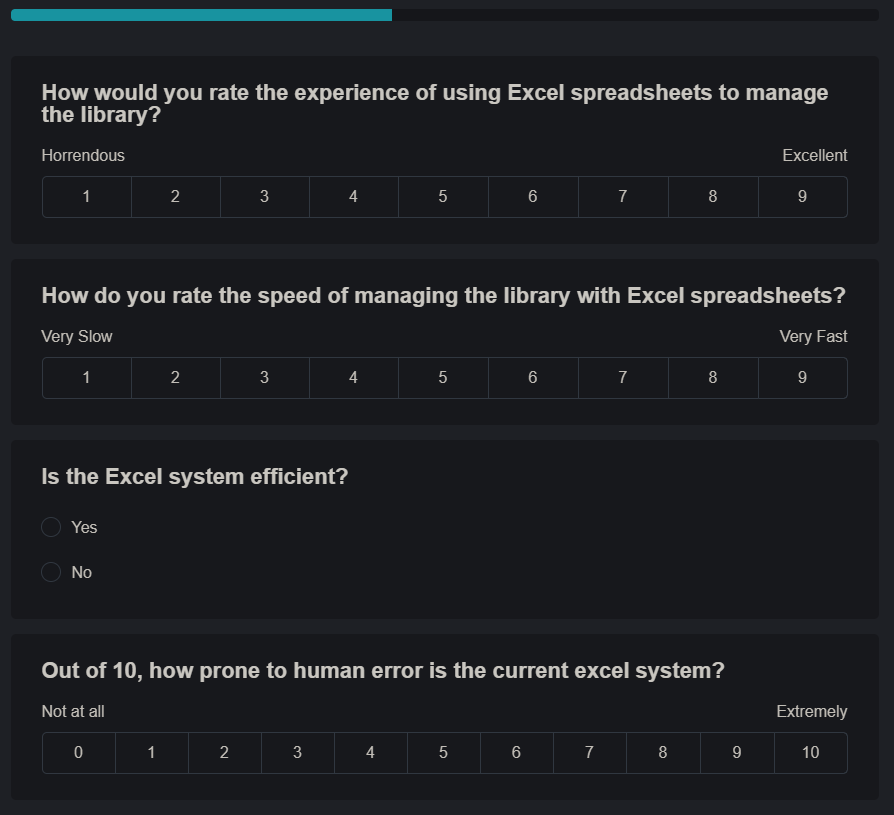

Question about respondants interest in a new system:

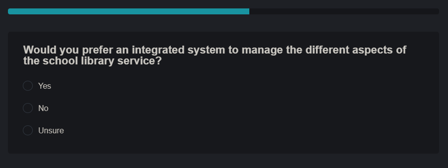

Questions about desired features in the new system:

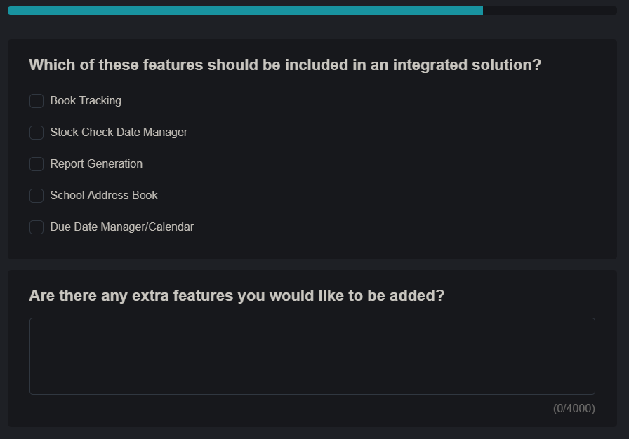

Questions about a report creation feature:

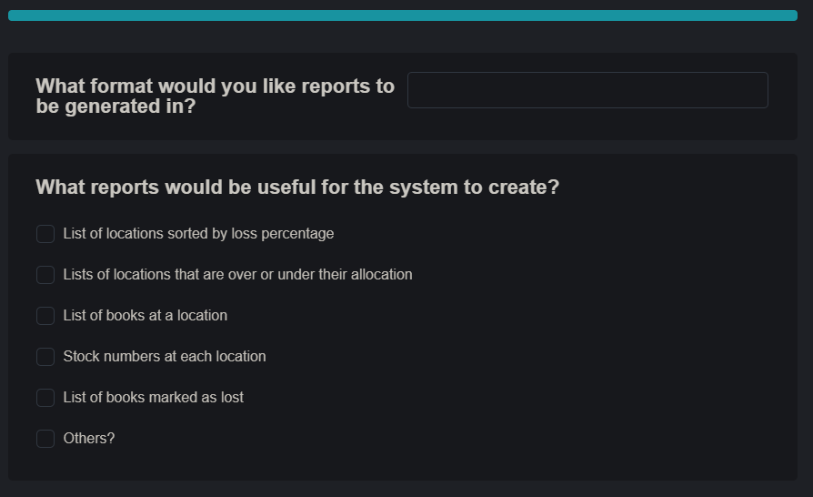
##### Results:
 **\*Insert Results here***
##### Evaluation:
This questionnaire has a few flaws in the way it was carried out.
Firstly the sample size that completed the questionnaire was smaller than the already limited target population that
is the SLS library assistants. This means that my responses are less likely to be varied or represent the views of
library assistants from other services offered by other counties who could be interested in using the system.

#### Identification of User Needs
* Reports
* Calendar
* no more than 2 of a certain title per school.

* format for reports

#### Acceptable Limitations:
* Only able to use it on one computer because the database is kept locally and doesn't support multiple concurrent
database connections.

### Data sources and destinations
The first main data source for the program is the database in which most data will be stored. In the databsse there are
five tables for the user logins, book details that have been modified, school details, loan information
and what loan a book is on.

The second main data source for the program is the Google Books API. The API will allow the program to collect
information about a book for various reasons. The most important feature for the user is that it can use the data from
Google Books to generate a list of books that are currently checked out to a school so that the school can make sure
they don't miss any books because they didn't know it was part of the SLS loan.

The data coming out of the program will be the lists of books at locations aswell as reports on the loss rate and other
statistics that can be calculated about the loans.
#### Data Volumes
The main data volume is the SQLite database backend of the program. It contains all of the data on books and loans
aswell as schools. The size of the database, once implemented in a production environment, will be much higher than the
testing version because of the difference in quantities of books and schools which means I can't yet estimate the size
of an implemented database.
#### Database ERD
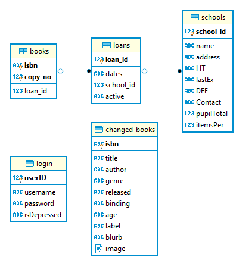
### Object analysis diagram
### Objectives for Proposed System:
| Objective                | Details                                                                                                                                                  |
|--------------------------|----------------------------------------------------------------------------------------------------------------------------------------------------------|
| Key Objective I          | The system must be able to sign books in and out to different schools.                                                                                   |
| Key Objective II         | The system should keep track of books in-stock and at different the schools.                                                                             |
| Key Objective III        | The system should have a database to store details about the schools that are subscribed to the service.                                                 |
| Key Objective IV         | The system must be able to produce reports about the loan history of individual schools and the service as a whole.                                      |
| Key Objective V          | The system should have a login policy to protect sensitive data about the subscribed schools.                                                            |
| Key Objective VI         | The graphical user interface must be user friendly and intuitive.                                                                                        |
| Key Objective VII        | The system should protect the database from SQL Injection attacks that could otherwise cause irreversible damage to the structure and contents of it.    |
| Additional Objective I   | The system should use Object Oriented Programming where possible                                                                                         |
| Additional Objective II  | The system could have a settings menu where the user can customise their experience (e.g. colour themes) and change the locations of any required files. |
| Additional Objective III | The system could have a calendar system to manage school visits.                                                                                         |
| Additional Objective IV  | The systems reporting function could calculate various statistics about their visits, borrowing history and amount of lost/damaged books.                |
| Additional Objective V   | The system could have a lookup system for books pertaining to a particular topic with a way to check their location.                                     |
| Additional Objective VI  | The system should be able to make use of a barcode scanner for faster signing in and out of books.                                                       |
| Additional Objective VII | The system should be simple to setup and install on the target users computers.                                                                          |

### Analysis data dictionary and ERD
#### Data Dictionary
| Table Name  | Columns | Description |
|:-------------|:---------|:-------------|
| books         | isbn, copy_no, loan_id | Links a copy of a certain book isbn to a loan via it's loan id. |
| changed_books | isbn, title, author, genre, binding, age, label, blurb, image | Stores the details of a modified book. |
| loans         | loan_id, date, school_id, active | Stores the details of a loan linking it to a school.|
| login         | userID, username, password, admin | Stores the login details of users for to use when accessing the system. |
| schools       | school_id, name, address, HT, lastEx, DFE, Contact, pupilTotal, itemsPer | Stores the details about a school. |


##### Books
|Column   |Required|Type   |Field Length|Default Values|Notes|
|---------|--------|-------|------------|--------------|-----|
| isbn    | ✔      |Text   | 10 or 13   |  N/A         |     |
| copy_no | ✔      |Integer| N/A        |  N/A         |     |
| loan_id |        |Integer| N/A        |  N/A         |     |

##### changed_books
|Column  |Required|Type   |Field Length|Default Values|Notes|
|--------|--------|-------|------------|--------------|-----|
|isbn    | ✔      |Text   | N/A        |  N/A         |     |
|title   |        |Integer| N/A        |  N/A         |     |
|author  |        |Integer| N/A        |  N/A         |     |
|genre   |        |Integer| N/A        |  N/A         |     |
|released|        |Integer| N/A        |  N/A         |     |
|binding |        |Integer| N/A        |  N/A         |     |
|age     |        |Integer| N/A        |  N/A         |     |
|label   |        |Integer| N/A        |  N/A         |     |
|blurb   |        |Integer| N/A        |  N/A         |     |
|image   |        |Blob   | N/A        |  N/A         |     |

##### loans
|Column   |Required|Type   |Field Length|Default Values|Notes|
|---------|--------|-------|------------|--------------|-----|
|loan_id  | ✔      |Integer| N/A        | N/A          |Auto-Increment|
|dates    | ✔      |Text   | N/A        | N/A          |     |
|school_id| ✔      |Integer| N/A        | N/A          |     |
|active   | ✔      |Text   | N/A        | N/A          |     |

##### logins
|Column  |Required|Type   |Field Length|Default Values|Notes|
|:-------|:-------|:------|:-----------|:-------------|:----|
|userID  | ✔      |Integer| N/A        | N/A          |     |
|username| ✔      |Text   | N/A        | N/A          |     |
|password| ✔      |Text   | 128        | N/A          |     |
|admin   | ✔      |Text   | N/A        | N/A          |     |

##### schools

| Column     | Required | Type    | Length | Default Values | Notes          |
|------------|----------|---------|--------|----------------|----------------|
| school_id  | Yes      | Integer | N/A    | N/A            | Auto-Increment |
| name       | No       | Text    | N/A    | N/A            |                |
| address    | No       | Text    | N/A    | N/A            |                |
| HT         | No       | Text    | N/A    | N/A            |                |
| lastEx     | No       | Text    | N/A    | N/A            |                |
| DFE        | No       | Text    | N/A    | N/A            |                |
| Contact    | No       | Text    | N/A    | N/A            |                |
| pupilTotal | No       | Integer | N/A    | N/A            |                |
| itemsPer   | No       | Integer | N/A    | N/A            |                |

### Realistic appraisal of the feasibility of potential solutions:
Key:

| Character | Note |
|---:|:-----------------|
| 🗸 | Very difficult but still possible |
| ✓ | Possible but time consuming       |
| ✔ | Yes                               |
| ❌ | No or not practical               |


| Project Method        | Windows | MacOS | Linux | Android | iOS | Experienced with | Has libraries to use | Supports USB Scanners |
|-----------------------|---------|-------|-------|---------|-----|------------------|----------------------|----------------------|
| Python Text Interface |    ✔    |  ✔   |  ✔    |   ❌    |  ❌  |       ✔         | ✔                   | ✔                     |
| Python Tkinter GUI    |    ✔    |  ✔   |  ✔    |   ✓    |  🗸  |       ✔          | ✔                   | ✓ (bluetooth version required for android and iOS) |
| Python Kivy GUI       |    ✔    |  ✔   |  ✔    |   ✔    |  ✔  |       🗸          | ✔                   | ✓ (bluetooth version required for android and iOS) |
| Visual Basic          |    ✔    |  ❌   |  ❌   |   ❌    |  ❌  |       ✔          | ❌                   | ✔                     |
| Java                  |    ✔    |  ✔   |  ✔    |   ✔    |  ✔  |       ❌          | ❌                   | ✔                     |
| WebApp                |    ✔    |  ✔   |  ✔    |    ✔   |  ✔  |       ❌          | ✔                   | ✓ (more setup required on user end +bluetooth version for mobile) |

### Justification of chosen solution:

* Python with Tkinter GUI

I have chosen to use Python with Tkinter for the GUI as my method of choice for my project. I am using it because
I know python quite well (compared to VB which is the only other language I have used before) and I have
already learnt Tkinter as a GUI implementation for python as opposed to learning Kivy just for being able to
easily put the program on mobile devices.

I also know that the users have Windows machines as their desk computers at the site meaning mobile
devices aren't a required feature.

## Design
### Overall System Design
### Description of modular structure of system
#### Modules:
All of the code has been separated into different python modules (*.py).
These modules can be imported into other parts of the code to allow modularity in the structure of the program.
The modules also reduce the amount of code needed to be written as they can imported to allow the calling of the functions inside the modules.

#### Objects:
Objects are callable by any other part of the code where the modules are imported.

Some objects that I've implemented are:
* Entry form object
* book details object
* Homepage object
* Multientry init form object
* Multientry form object
* settings menu object
* School Details View menu
* School Details Buttons menu

| Object:       | Description: |Uses:| Called by: | Calls: |
|---------------|--------------|------------|------------|--------|
| Entry Form    |For entering a single value to be processed.|Enering an ISBN to view the details of that book.|Homepage|Book Details|
| Book Details  |Displays the title, author, etc that is passed into the object.|Displaying the details of a book.|Entry Form|Homepage|
| Homepage      |The main menu of the program. Has buttons to call each of the parts of the program.|Calling smaller independent parts of the program such as Settings and the Multientry form.|Starting the program, Book Details, Settings, Multientry, Entry Form.|Entry Form, Multientry, Settings Menu|
| Multientry Init|For choosing a school to sign books in from or out to.|Configures the multientry page to the correct school and correct method.|Homepage|Multientry|
| Multientry    |For entering multiple values to be processed.|Entering many ISBNs to be assigned to a loan.|Multientry Init|Homepage|
| Settings Menu |Changing settings that apply globally to the program.|Changing the colour theme of the program.|Homepage|Homepage|
| School Details View|For the viewing, editing or creating of school profiles in the database.|Can be used to create a new school profile in the database, edit a pre-existing one or viewing the details of one.|School Details Init.|Homepage.|
| School Details Init|Initialising the school details view object.|Opens the School Details View in new school mode for creating a new school or selecting an existing school|Homepage.|School Details View.|

#### Function Modules
Some of the modules I've written only contain functions and algorithms that other parts of the program can import and use.

The function modules that I've written are:
* books_api
* gui
* img2gif
* misc_python
* sql

The "books_api" module is for interacting with and processing the data from the Google Books API. It contains three
functions. The first function takes an ISBN from the program and returns properly formatted python dictionary
with all of the details about the book. The second function is used to get a specific detail about a book from
the dictionary returned by the first function. The third one runs the second function for all of the details required
in the book details window and returns them in a format that can be accepted by the book details object for being
displayed or compared against the modified data from that window.

The "gui" module is written to make bringing up a new window easier. Each function in the module contains the few lines
of code required to call a new GUI object so that other parts of the program can do so in one line. It also makes the
program code easier to read since the same lines of code are repeated less often.

The "img2gif" module is for the manipulation of the book cover images before they get displayed in the Book Details
window. The tkinter canvas object on the window only accepts image files in the GIF type whereas the Google Books API
stores all of the images as JPEG files. This means in order to display them correctly, the program needs a way to
convert between the different file types. As well as the file type discrepancy, there are often differences between the
resolution of the image file from the Google Books API and the tkinter canvas object in which the images are needed to
be displayed. This module also solves that issue by resizing the images to the correct resolution to reduce the blank
space around the image and to keep as much of the cover from being cropped.

The "misc_python" module is different to the other function modules in the fact that it wasn't written specifically for
this program. Instead, it is a collection of useful functions and algorithms that I have written and collated into one
module for use in any program I write. One example of a function it contains is a binary search algorithm for searching
through lists for a specific item. Another function is a sorting algorithm which sorts alphabetically and numerically
to make sure that multiple digit numbers are sorted correctly and not by the first digit as happens with algorithms like
quicksort.

The last function module I've written is a module for interacting with the sqlite database that the program is based
around. This module is made up of lots of functions, each with it's own SQL query, that can be executed in a connection
to the database using variables that are passed into the function from the main program.


#### Modular Design
* **Login Screen**
  * Login Button
    * **Main Menu Screen**
      * Book Details
        * **Single Entry**
          * Submit
            * **Book Details** (Title, Author etc of the book specified by isbn)
              * Save Changes
              * Close
              * Revert to online data
      * Sign Out Books
        * **Destination Select Screen**
          * Sign In
            * **Multi-Entry**
              * Sign In
          * Sign Out
            * **Multi-Entry**
              * Sign Out
      * School Details
        * **School Selection Screen**
          * Edit School
            * **School Details** (Edit Mode)
          * New School
            * **School Details** (New Mode)
          * View School
            * **School Details** (View Mode)
      * Settings
        * **Settings**
          * Theme Select
          * Database Location
          * Root Folder
          * Add New User (Only when admin)
            * **Add New User**
          * Close
      * Log Off
      * Quit Program
### Definition of data requirements
### Identification of appropriate storage media
### Entity relationship diagram(Normalised)
#### Entity Relationship Diagram:

#### Code:
```
graph LR
 Homepage-->School-Details-Start(School Details Start)
 School-Details-Start-->School-Details
 School-Details-->Homepage

 Homepage-->Multi-Entry
 Multi-Entry-->Homepage

 Homepage-->Entry-Form(Entry Form)
 Entry-Form-->Book-Details(Book Details)
 Book-Details-->Homepage

 Settings-->Homepage{Homepage}
 Homepage-->Settings(Settings)
 Settings-.-theme((theme.json))

 School-Details-.-SQL((SQL.py))
 School-Details-Start-.-SQL((SQL.py))
 Book-Details-.-SQL((SQL.py))
 Multi-Entry-.-SQL((SQL.py))
 Book-Details-.-GB((Google Books))
 Multi-Entry-.-GB((Google Books))

 subgraph Key
  key1{Main Menu}
  key2(Simple GUI Module)
  key3((Data Storage))
  key1-- Module Calling -->key2
  key2-. Data Transfer .-key3
 end
```
https://mermaidjs.github.io/mermaid-live-editor/

### Identification of processes and suitable algorithms for data transformation

### Class and object diagrams
### User interface design (HC)

#### Login Screen
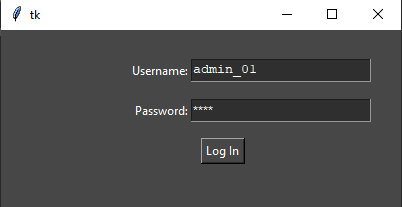

This is the Login screen that is presented when the user opens the application or logs out from the homepage.
The menu is characterised by a pair of entry fields, one for the username and one for the password, as well a
submit button. The button isn't the only way to run the authentication process as the user can also
press `Enter` to submit the details as is standard of most login systems. The password field is obscured
upon entry with asterisks (`*`) replacing each character as is standard with almost all Windows-based
login systems as well as on many websites. When submitted, the password is hashed with an SHA512 cryptographic
hash function before being compared with the hashed password associated with the given username that is
stored in the databases login's table.

#### Homepage
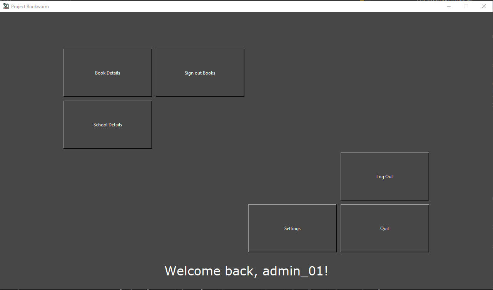

This is the homepage for the application where the user can navigate to all of the various parts. The homepage
is made up of various buttons linked to the different sections of the program. There are also buttons for
`Log Off` and `Quit` to allow the user to end their unique session or to completely close the application
respectively. At the top of the window is the program name and logo and at the bottom is a welcome back
message with the current username.

#### Book Details


This part of the book details process is for taking the inputted isbn for a book and passing it through to the
next section. The menu has a entry box for the isbn and a label above it to instruct the user on what to input.
Below the entry box is a button which will submit the contents of the entry box to the next bit of the
Book Details section.

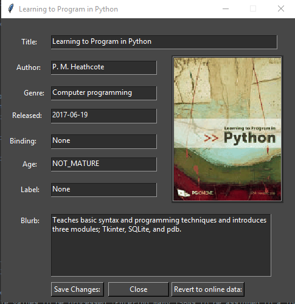

This is the window that is used to display the details of a book. The details are pulled from either the sqlite
database if there is an entry for that isbn or the Google Books API if there isn't. The details that are available for
being displayed are:
* Title (and subtitle if applicable)
* Author(s)
* Genre
* Release/Publish Date
* Age Rating
* Blurb
* Cover Image

and two placeholder fields for anything else requested by the end users.
At the bottom of the window are three buttons. One of these will save any changes made to the details by the
user to the sqlite database. The next one will close this part of the program and return to the homepage of
the application. The last button will delete any entry in the database and allow the program to use the original
Google Books data for the details.

#### School Details
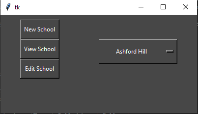

This window is for selecting a school to view or edit the details of or to add a new school to the system.
There are three buttons on the left of the window:
* `New School` for creating a profile of a new school in the database
* `View School` for viewing the details of an existing school profile
* `Edit School` for editing the details of an existing school profile

On the right of the window is drop down menu containing the list of existing school profiles to select from for
use in the `View School` or `Edit School` windows.

The School Details main window has three variants which are chosen in the previous window.
All of the variants are have the same fields to fill in or be viewed but they start differently depending
on the variant.
The fields are:
* School Name
* Head Teacher
* Last Exchange
* Contact:
* DFE No'
* No' of Pupils
* Allocation per pupil
* Total Allocation
* Address
There is also a button next to the address field which will open Google Maps with the location of the school
in the default web browser.
At the bottom of all of the variants is a button to close the details menu and return to the homepage.  

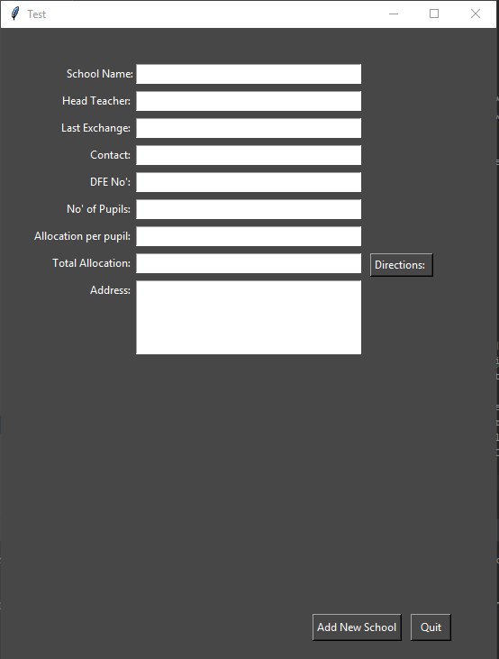

The first variant of the School Details window is for create a new profile for a school. It has the same fields
as the other variants but all are left blank for the user to fill in. At the bottom of the field is an
`Add New School` button to save the entered details to the database as a new school.

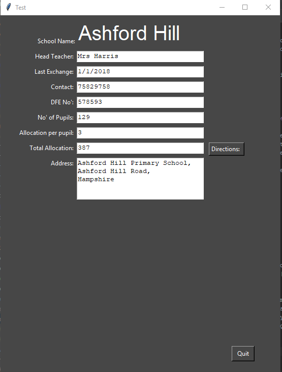

The second variant does not have editable field for the school name or a button to save changes as it is only
for viewing the details of a chosen school.

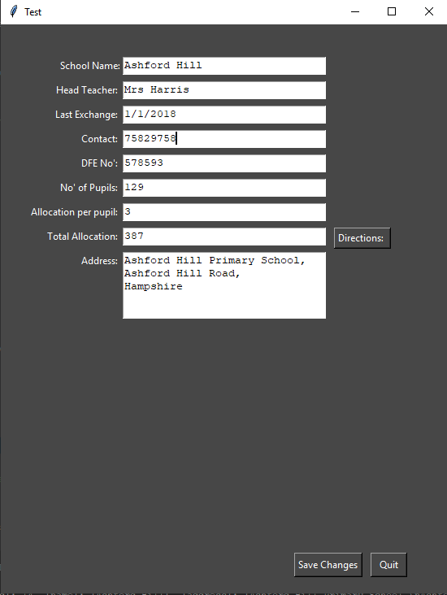

The third and final variant is for changing the details of a school. As such, it starts with all of the details fields
filled with the details in the database ready for being changed by the user and has a `Save Changes` button
at the bottom for committing any changes to the database.

#### Sign Out Books

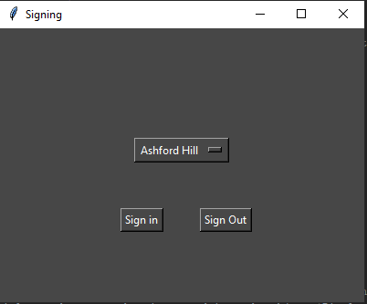

This window is for selecting a school to sign books out to or in from. It has a list of the schools in the
system in a drop down menu to select one and two buttons to choose whether you're signing books in or out with
respect to that location.

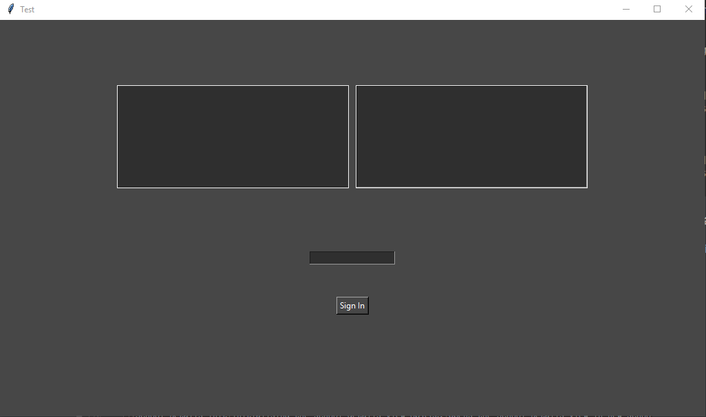

This window has a single entry box for entering an isbn of a book. The user enters the ISBN and presses the
`Enter` key. This puts the ISBN in the list box on the left and collects the title from the database or the
Google Books API and puts it in the list on the right to help make sure the correct book has been entered.
Once all of the ISBNs are entered, the user clicks on the `Sign In`/`Sign Out` button which will sign the
books out to the location selected in the previous window.

#### Settings

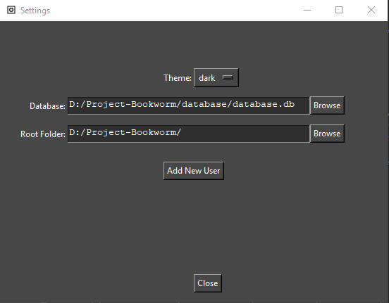

This window is where the user can change any settings pertaining to the application that might need to
be modified.
The first setting is the application-wide theme option. This is changed via a drop down menu with a list of the
available themes that can be chosen from.
The next setting is the location of the sqlite database. This is chosen via a file path to the database file
which can be selected via the Windows Open File dialog. The next setting is the root folder location for the
program to use as a file location for the temporary storage of cover images for books and long term storage of
icons required for the program.
The last setting is an `Add New User` button for creating a new user profile which can be used on the login
screen to access the application. This setting is only available to accounts with administrator privileges.

### Hardware specification
#### Input Devices
Currently Required: Keyboard, Mouse.
Optional: Barcode Scanner (untested)
* Keyboard: allows manual entry of barcodes and editing of book details.
* Mouse: for interaction with buttons on the forms as pressing enter after typing doesnt work. (tab is untested.)
* Barcode scanner: easier input of isbns stored as barcodes on most books.
#### Output Devices
Required: Monitor.
* Monitor: viewing of GUI.
#### Storage devices
Required: Program files and sqlite database. unknown sizes as unfinished. database may be moved to a server.
#### Processor and Memory requirements
* a processor is required. working: i5-4460, i5-4210M \n
* some amount of ram is required. working: 8gb sodimm ddr3, 8gb ddr3 desktop dimm

#### Table:

|               | Processors    | Memory        | Storage                        | OS        | Screen Resolution | Peripherals      |
|---------------|---------------|---------------|--------------------------------|-----------|-------------------|------------------|
| Minimum:      | i5-4210M      |8GB SODIMM DDR3|80.1MB w/out third-party modules|Win7 32bit |                   |Keyboard and Mouse|
| Recommended:  | Ryzen 7 1800x |16GB DDR4      |8GB with all required modules   |Win10 64bit| 1920x1080@60Hz    |                  |
| Also Working: | i5-4460       |8GB DIMM DDR3  |                                |           | 1920x1080@60Hz    |                  |


## Testing

### Description of measures planned for security and integrity of data and system security
* sql injection prevention

### Overall test strategy
* test for sql injection
* see if it breaks under normal use cases
* test under extreme use cases to see if it breaks

### Testing Details

## System Maintenance
### System Overview
When the system is opened by the user, they are greeted with a log on form. This log on form is setup using entry
boxes to collect the users login credentials to allow the user to log on and access the system. The user will type
in their log on credentials and press the `Enter` key or click the `Log In` button on the form. If the credentials
match any of the stored credentials in the database, the user will be taken to the system homepage.

The system homepage is the way the user accesses the other parts of the system from one central form. It has buttons
for the user to press to take them to the various other parts.
One of the other parts is a way to look up the details of a book by it's isbn. The user enters the isbn into a form
that appears when the `Book Details` button on the homepage which then passes it through to the details form.
The details form displays the books title, authors, genre, release/published date, age rating, blurb and cover image.

Another section is the part for loaning books out to schools and returning them to the base location. The first part
of this sub-system is a form to select the school that is having books exchanged with using a drop-down menu and a
pair of buttons either `Sign Out` books to that school or `Sign In` books from that school. The second part of the
sub-system is a form for entering the isbns that are part of the exchange. The isbns are entered into a entry box
and stored visually in a list box with the corresponding titles in another list box next to it. Once the isbns have
been entered and the submit button has been pressed, the system processes all the books and adds them to the a new
loan in the database for signing out books or to the existing loan for returning them to the base.

Another section is the part for retrieving data about a school in the database. The first part of this sub-system is
a form for selecting the school from a drop-down menu and three buttons to select which mode the second form should
open in. Whether the user is viewing or editing a school or   

### Sampled Detailed Algorithms

## User Guide

#### signing out instructions draft
Another section is the part for loaning books out to schools and returning them to the base location. To start the
process for re-assigning books, the user clicks on the `Sign Out Books` button on the homepage which opens a form to
select the school the process should reference with a drop down menu. Once the user has selected as school, there is
a choice of two buttons, one to `Sign Out` books to a school and another (`Sign In`) for returning books to the base.
When the correct button is pressed, a new window is opened with two lists, an entry box and a button. The user should
enter the isbn of a book to be processed and press `Enter` which will add the isbn to the first list box and the title
associated with that isbn to the second. The user should repeat entering isbns until every book they wish to
process has been entered.

### Contents

## Evaluation
## Program Code
### Python Requirements:
* Requests
  * idna
  * urllib3
  * certifi
  * chardet
* PIL (Python Image Library)
* Tkinter
* sqlite3
* json
* hashlib
* re
* googlebooks
* os
* urllib
* misc_python
* webbrowser
* time
